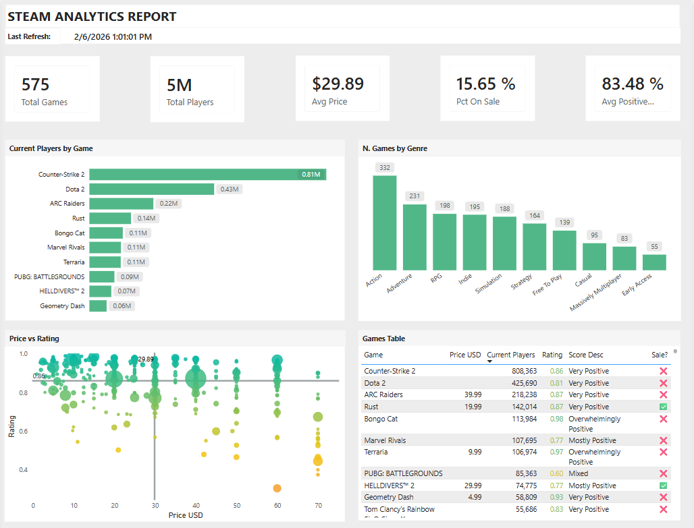
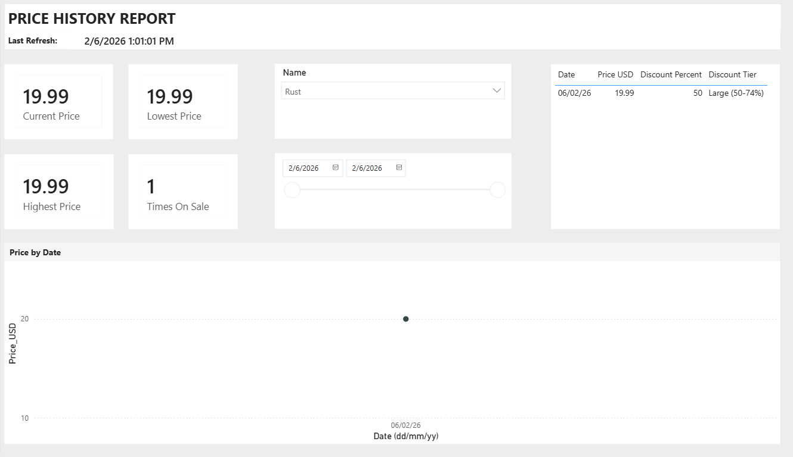
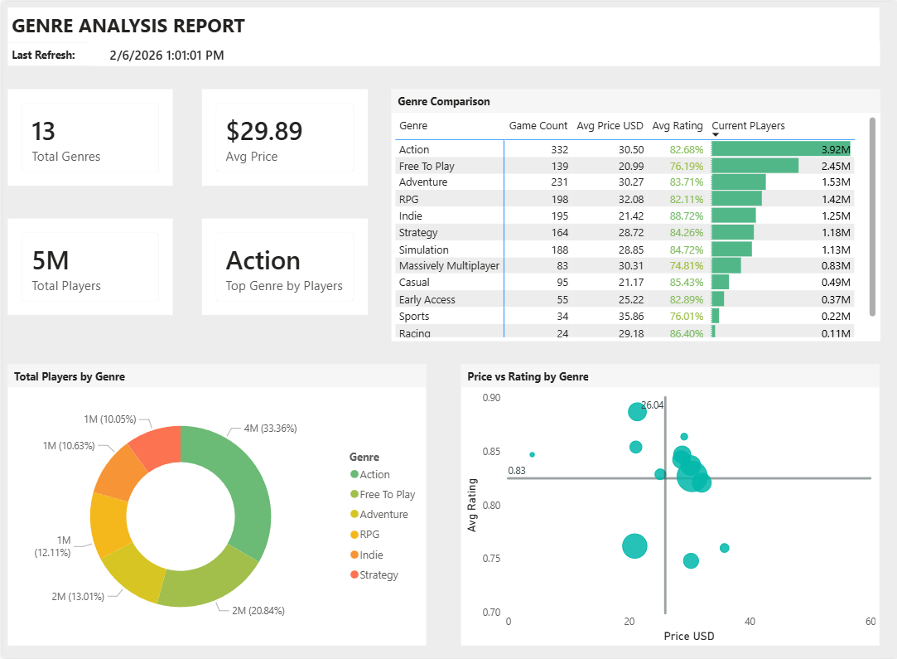

# Steam Analytics Platform

A modern data engineering solution that extracts, transforms, and visualizes Steam gaming data using Microsoft Fabric's medallion architecture.



---

## Table of Contents

- [Overview](#overview)
- [Architecture](#architecture)
- [Features](#features)
- [Tech Stack](#tech-stack)
- [Project Structure](#project-structure)
- [Data Model](#data-model)
- [Setup & Configuration](#setup--configuration)
- [Usage](#usage)
- [Dashboard](#dashboard)
- [Future Improvements](#future-improvements)

---

## Overview

This project demonstrates an end-to-end data engineering pipeline that:

- **Extracts** data from official Steam APIs (150,000+ games)
- **Transforms** raw data through Bronze → Silver → Gold layers
- **Visualizes** insights through an interactive Power BI dashboard
- **Scales** dynamically with intelligent game prioritization

### Key Metrics

| Metric | Value |
|--------|-------|
| Games Tracked | 150,000+ |
| Daily Sync (HIGH priority) | ~2,000 games |
| API Sources | 3 (Store, Reviews, Players) |
| Refresh Frequency | Daily |

---

## Architecture
```
┌─────────────────────────────────────────────────────────────────────────────┐
│                           STEAM ANALYTICS PLATFORM                          │
├─────────────────────────────────────────────────────────────────────────────┤
│                                                                             │
│   STEAM APIs                    MICROSOFT FABRIC                            │
│   ──────────                    ────────────────                            │
│                                                                             │
│   ┌─────────────┐              ┌──────────────────────────────────────────┐ │
│   │ Store API   │──────────────│►  BRONZE (Raw)                           │ │
│   │ Reviews API │──────────────│►  ├── raw_steam_store                    │ │
│   │ Players API │──────────────│►  ├── raw_steam_reviews                  │ │
│   │ AppList API │──────────────│►  ├── raw_steam_player_stats             │ │
│   └─────────────┘              │   └── game_catalog                       │ │
│                                │                                          │ │
│                                │   SILVER (Cleaned + SCD2)                │ │
│                                │   ├── dim_games                          │ │
│                                │   ├── dim_game_reviews                   │ │
│                                │   └── fact_player_counts                 │ │
│                                │                                          │ │
│                                │   GOLD (Aggregated)                      │ │
│                                │   ├── agg_game_metrics                   │ │
│                                │   ├── agg_price_history                  │ │
│                                │   └── agg_genre_summary                  │ │
│                                │                                          │ │
│                                └──────────────────────────────────────────┘ │
│                                                   │                         │
│                                                   ▼                         │
│                                ┌──────────────────────────────────────────┐ │
│                                │         POWER BI DASHBOARD               │ │
│                                │   ├── Game Overview                      │ │
│                                │   ├── Price History                      │ │
│                                │   └── Genre Analysis                     │ │
│                                └──────────────────────────────────────────┘ │
│                                                                             │
└─────────────────────────────────────────────────────────────────────────────┘
```

### Medallion Architecture

| Layer | Purpose | Tables | Format |
|-------|---------|--------|--------|
| **Bronze** | Raw data ingestion | 0 tables | Parquet Files |
| **Silver** | Cleaned, validated, SCD Type 2 | 3 tables | Delta |
| **Gold** | Business aggregations | 3 tables | Delta |

---

## Features

### Dynamic Game Catalog
- Automatically discovers new games via Steam's IStoreService API
- Prioritizes games based on player activity (HIGH/MEDIUM/LOW/SKIP)
- Updates priorities daily based on fresh player counts

### Smart Sync Scheduling
```
┌─────────────┬────────────┬─────────────────────────┐
│ Priority    │ Threshold  │ Sync Frequency          │
├─────────────┼────────────┼─────────────────────────┤
│ HIGH        │ ≥1,000     │ Daily                   │
│ MEDIUM      │ ≥100       │ Weekly (Mon/Sat/Sun)    │
│ LOW         │ ≥1         │ Monthly                 │
│ SKIP        │ 0          │ Never                   │
└─────────────┴────────────┴─────────────────────────┘
```

### SCD Type 2 Tracking
- Tracks historical changes in game prices and reviews
- Maintains `valid_from`, `valid_to`, and `is_current` flags
- Enables price trend analysis over time

### Robust Data Pipeline
- Retry logic with exponential backoff
- Rate limiting (10 req/sec)
- Comprehensive error handling and logging

---

## Tech Stack

| Category | Technology |
|----------|------------|
| **Cloud Platform** | Microsoft Fabric |
| **Data Lake** | OneLake |
| **Data Format** | Delta Lake |
| **Compute** | Fabric Spark |
| **Orchestration** | Fabric Data Pipelines |
| **Visualization** | Power BI |
| **Language** | Python 3.11+ |
| **HTTP Client** | httpx (async) |
| **Validation** | Pydantic |
| **Logging** | structlog |

---

## Project Structure
```
steam-analytics/
├── src/steam_analytics/
│   ├── config.py                 # Pydantic settings
│   ├── catalog/
│   │   ├── __init__.py
│   │   └── manager.py            # Game prioritization logic
│   ├── ingestion/
│   │   ├── extractors/
│   │   │   ├── base.py           # Base extractor class
│   │   │   ├── app_list.py       # Steam catalog extractor
│   │   │   ├── steam_store.py    # Store API extractor
│   │   │   ├── steam_reviews.py  # Reviews API extractor
│   │   │   └── steam_player_stats.py
│   │   ├── orchestrator.py       # Ingestion orchestration
│   │   └── onelake_writer.py     # Direct OneLake writes
│   └── transformation/
│       ├── silver.py             # Silver layer transforms
│       └── gold.py               # Gold layer aggregations
├── notebooks/
│   ├── 00_catalog_discovery.ipynb
│   ├── 00_catalog_refresh.ipynb
│   ├── 00_monitor.ipynb
│   ├── 01_bronze_ingestion.ipynb
│   ├── 02_silver_transform.ipynb
│   └── 03_gold_transform.ipynb
├── tests/
│   ├── integration/
|   |   ├── test_app_list.py
|   |   ├── test_extractors.py
|   |   ├── test_rate_limiter.py
│   ├── unit/
|   |   ├── test_bronze_schemas.py
|   |   ├── test_config.py
|   |   ├── test_contracts.py
├── docs/
│   ├── images/
│   ├── setup.md
│   ├── architecture.md
│   └── data-model.md
├── pyproject.toml
└── README.md
```

---

## Data Model

### Bronze Layer (Raw)
```
raw_steam_store
├── app_id (INT)
├── name (STRING)
├── price_overview (STRUCT)
├── genres (ARRAY)
├── release_date (STRUCT)
├── _extracted_at (TIMESTAMP)
└── _batch_id (STRING)

raw_steam_reviews
├── app_id (INT)
├── total_positive (INT)
├── total_negative (INT)
├── review_score_desc (STRING)
├── _extracted_at (TIMESTAMP)
└── _batch_id (STRING)

raw_steam_player_stats
├── app_id (INT)
├── player_count (INT)
├── _extracted_at (TIMESTAMP)
└── _batch_id (STRING)

game_catalog
├── app_id (INT)
├── name (STRING)
├── player_count (INT)
├── priority (STRING)
├── discovered_at (TIMESTAMP)
└── last_synced_at (TIMESTAMP)
```

### Silver Layer (Cleaned + SCD2)
```
dim_games
├── game_sk (BIGINT) - Surrogate key
├── app_id (INT)
├── name (STRING)
├── price_initial_cents (INT)
├── price_final_cents (INT)
├── is_free (BOOLEAN)
├── genres (ARRAY<STRING>)
├── valid_from (TIMESTAMP)
├── valid_to (TIMESTAMP)
└── is_current (BOOLEAN)

dim_game_reviews
├── review_sk (BIGINT)
├── app_id (INT)
├── total_reviews (INT)
├── positive_ratio (DOUBLE)
├── review_score_desc (STRING)
├── valid_from (TIMESTAMP)
├── valid_to (TIMESTAMP)
└── is_current (BOOLEAN)

fact_player_counts
├── app_id (INT)
├── player_count (INT)
├── snapshot_timestamp (TIMESTAMP)
└── snapshot_date (DATE)
```

### Gold Layer (Aggregated)
```
agg_game_metrics
├── app_id (INT)
├── name (STRING)
├── price_usd (DOUBLE)
├── current_players (INT)
├── positive_ratio (DOUBLE)
├── popularity_score (DOUBLE)
└── _aggregated_at (TIMESTAMP)

agg_price_history
├── app_id (INT)
├── name (STRING)
├── price_final_usd (DOUBLE)
├── price_discount_percent (INT)
├── discount_tier (STRING)
├── price_effective_from (TIMESTAMP)
└── is_current (BOOLEAN)

agg_genre_summary
├── genre (STRING)
├── game_count (INT)
├── avg_price_usd (DOUBLE)
├── avg_positive_ratio (DOUBLE)
├── total_current_players (BIGINT)
└── _aggregated_at (TIMESTAMP)
```

---

## Setup & Configuration

### Prerequisites

- Microsoft Fabric workspace
- Steam API Key ([Get one here](https://steamcommunity.com/dev/apikey))
- Python 3.11+

### Environment Variables
```bash
# Steam API
STEAM__API_KEY=your_steam_api_key

# Microsoft Fabric
FABRIC__WORKSPACE_ID=your_workspace_id
FABRIC__BRONZE_LAKEHOUSE_ID=your_bronze_lakehouse_id
FABRIC__SILVER_LAKEHOUSE_ID=your_silver_lakehouse_id
FABRIC__GOLD_LAKEHOUSE_ID=your_gold_lakehouse_id

# Azure (for local development)
AZURE_TENANT_ID=your_tenant_id
AZURE_CLIENT_ID=your_client_id
AZURE_CLIENT_SECRET=your_client_secret
```

### Fabric Environment

Create a custom environment in Microsoft Fabric with the following libraries:

| Library | Version |
|---------|---------|
| azure-identity | 1.25.1 |
| azure-storage-file-datalake | 12.23.0 |
| httpx | 0.28.1 |
| pydantic | 2.12.5 |
| pydantic-settings | 2.12.0 |
| structlog | 25.5.0 |
| tenacity | 9.1.2 |

**Steps:**
1. In Fabric workspace, go to **Manage** → **Environment**
2. Create new environment: `env_steam_analytics`
3. Add libraries from PyPI (Public libraries)
4. Publish and attach to notebooks

### Installation
```bash
# Clone repository
git clone https://github.com/yourusername/steam-analytics.git
cd steam-analytics

# Install dependencies
pip install -e ".[dev]"

# Run tests
pytest
```

### Fabric Setup

1. Create 3 Lakehouses: `lh_bronze`, `lh_silver`, `lh_gold`
2. Upload `src/` folder to `lh_bronze/Files/`
3. Import notebooks to workspace
4. Run `00_catalog_discovery.ipynb` (once)
5. Create pipeline with scheduled refresh

---

## Usage

### Initial Setup (One-time)
```python
# Run catalog discovery to populate game catalog
# This takes ~1-2 hours for 150K+ games
notebooks/00_catalog_discovery.ipynb
```

### Daily Pipeline
```
pl_steam_analytics_daily (10:10 PT)
├── 00_catalog_refresh    (~2 min)
├── 01_bronze_ingestion   (~10-60 min depending on day)
├── 02_silver_transform   (~5 min)
└── 03_gold_transform     (~2 min)
```

### Monitor Health
```python
# Check pipeline status and data freshness
notebooks/00_monitor.ipynb
```

---

## Dashboard

### Page 1: Overview


- KPI cards: Total Games, Players, Avg Price, On Sale %, Avg Rating
- Top games by current players
- Genre distribution
- Price vs Rating scatter plot
- Games table with conditional formatting

### Page 2: Price History


- Game selector dropdown
- Price over time line chart
- Price statistics cards
- Discount history table

### Page 3: Genre Analysis


- Genre comparison matrix
- Players by genre donut chart
- Price vs Rating by genre scatter plot

---

## Future Improvements

- [ ] Add more Steam API endpoints (achievements, player counts history)
- [ ] Implement real-time streaming with Fabric Event Streams
- [ ] Add predictive analytics (price drop predictions)
- [ ] Create alerting for significant player count changes
- [ ] Add CI/CD pipeline with GitHub Actions
- [ ] Implement data quality checks with Great Expectations

---

## License

MIT License - see [LICENSE](LICENSE) for details.

---

## Author

**Eduardo Jafet Cendon Aguilar**
- LinkedIn: [http://www.linkedin.com/in/eduardocendon](http://www.linkedin.com/in/eduardocendon)
- GitHub: [https://github.com/gatotroller](https://github.com/gatotroller)
